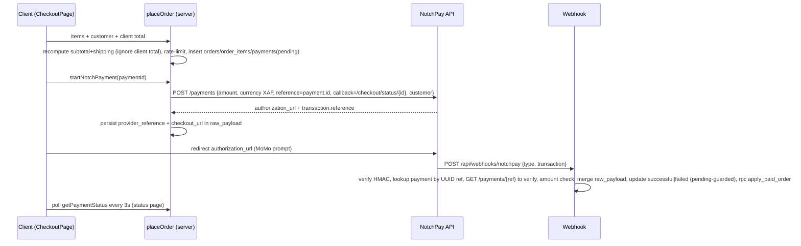

# Mixtas Fashion Store

Modern e-commerce for fashion essentials — storefront, checkout with Mobile Money, and admin dashboard. Built with Next.js App Router + Supabase + NotchPay.

    

## Table of Contents

- [Overview](#overview)
- [Tech Stack](#tech-stack)
- [Features](#features)
- [Folder Structure](#folder-structure)
- [Getting Started](#getting-started)
- [Environment Variables](#environment-variables)
- [Database (Supabase)](#database-supabase)
- [Auth & Logic Flow](#auth--logic-flow)
- [Checkout & Payments (NotchPay)](#checkout--payments-notchpay)
- [Admin Dashboard](#admin-dashboard)
- [API & Routes](#api--routes)
- [Scripts](#scripts)
- [Deployment](#deployment)
- [Security Notes](#security-notes)
- [Bugfix Audit (2026-09-25)](#bugfix-audit-2026-09-25)
- [Known Limitations / Roadmap](#known-limitations--roadmap)

## Overview

Mixtas is a full-stack fashion store for the Cameroonian / CEMAC market (prices in FCFA / XAF):

- Public storefront: home, shop with category filters, product detail (`/product/[id]`), cart, wishlist, journal/blog, contact, account.
- Checkout: guest + authenticated orders, Mobile Money via NotchPay, order-status polling page.
- Admin (`/admin`): orders, products + image uploads, categories, payments (incl. manual confirm), users, audit view, dashboard stats.
- SEO: per-product JSON-LD, sitemap, robots, metadata layout.

Design language: serif headings, warm neutrals (`#faf8f5`, `#182938`), shadcn-style tokens, Lucide icons.

## Tech Stack

| Layer | Technology |
|---|---|
| Framework | Next.js 16 (App Router, Server Components + Server Actions) |
| UI | React 19, Tailwind CSS 4, shadcn/ui tokens, `lucide-react`, `tw-animate-css` |
| Forms/validation | `react-hook-form`, `@hookform/resolvers`, `zod` |
| Backend | Supabase Postgres + Auth + Storage (`@supabase/ssr`, `@supabase/supabase-js`) |
| Payments | NotchPay REST (`/payments`, verify `/payments/{ref}`), HMAC webhook |
| Analytics | `@vercel/analytics` (prod only) |
| Charts (admin) | `recharts` |
| Dates | `date-fns`, `Intl.DateTimeFormat` wrappers |
| Package manager | `pnpm@12.3.4` |

## Features

Storefront:
- Hero carousel, promo mosaic, category tabs (`Women, Men, Jackets, Shoes, Bags, Accessories`), product cards with wishlist.
- Product detail with gallery, size selector, related products, JSON-LD.
- Cart (size-aware quantities) + wishlist via React context.
- Journal with featured/editorial sections linking directly to products.

Checkout:
- Server-validated order creation, shipping rule (2 500 FCFA under 50 000, free above).
- NotchPay init (`POST https://api.notchpay.co/payments`), `checkout_url` reuse, 409 handling.
- Status page `/checkout/status/[paymentId]` with 3s poller (3 min timeout).
- HMAC webhook (`payment.complete|failed|canceled|expired`) with server-side verification + amount check + idempotent `apply_paid_order` RPC.

Admin:
- Dashboard KPIs, orders with status transitions, products with Supabase Storage uploads, categories, payments (auto + manual), users/roles, audit placeholder.

## Folder Structure

```
app/
  layout.tsx                # root metadata + StoreProvider (+ AdminStoreProvider)
  page.tsx                  # home (hero, mosaic, grids)
  shop/page.tsx             # ShopClient (filters)
  product/[id]/page.tsx     # canonical detail (Supabase + static fallback, 404)
  products/[id]/page.tsx    # redirect alias -> /product/[id]
  cart/page.tsx wishlist/page.tsx
  blog/page.tsx contact/page.tsx account/page.tsx login/ signup/
  checkout/
    page.tsx                # CheckoutPage (client)
    actions.ts              # placeOrder (server)
    notchpay-actions.ts     # startNotchPayment, getPaymentStatus
    status/[paymentId]/page.tsx + poller.tsx
  api/webhooks/notchpay/route.ts
  admin/
    layout.tsx page.tsx login/page.tsx error.tsx
    products/ orders/ categories/ payments/ users/ audit/
    */actions.ts            # Supabase server actions (requireAdmin)
  sitemap.ts robots.ts error.tsx not-found.tsx secondary-routes.tsx
components/
  store.tsx                 # StoreProvider, SiteHeader, Footer, ProductCard/Actions/Grid, Hero, FilterBar
  admin/                    # sidebar, topbar, data-table, product-form, image-uploader, stat-card, etc.
  ui/button.tsx seo/product-json-ld.tsx
hooks/use-checkout.ts       # idempotency key helper
lib/
  catalog.ts                # static products/blog fallback, money(), getProduct()
  format.ts                 # formatPrice/Date/DateTime, truncateId
  validations.ts            # zod schemas (product, category, order status, payment confirm)
  auth.ts                   # requireAdmin / requireUser
  audit.ts                  # logAdminAction (stub)
  admin-store.tsx           # client mock store (dev fallback)
  supabase/server.ts client.ts public.ts admin.ts
  payments/notchpay.ts      # initializeNotchPayPayment
supabase/
  schema.sql                # full Postgres schema + RLS + RPCs
  activity-logger.ts activity.log
middleware.ts               # Supabase session refresh + /admin guard
```

## Getting Started

Prerequisites: Node 20+, pnpm 12, Supabase project, NotchPay business account.

```bash
pnpm install
cp .env.example .env   # fill values (see below)
pnpm dev               # http://localhost:3000
```

Apply DB:

```bash
# In Supabase Dashboard > SQL Editor, run supabase/schema.sql
# Create Storage bucket: product-images (public read)
```

## Environment Variables

| Var | Scope | Required | Description |
|---|---|---|---|
| `NEXT_PUBLIC_SITE_URL` | public | yes | Canonical URL (e.g. `https://mixtas-fashion.com`) |
| `NEXT_PUBLIC_SUPABASE_URL` | public | yes | Supabase project URL |
| `NEXT_PUBLIC_SUPABASE_ANON_KEY` | public | yes | Supabase anon key |
| `SUPABASE_SERVICE_ROLE_KEY` | server | yes | Service-role (admin client, webhooks, order writes). Never `NEXT_PUBLIC_` |
| `NOTCHPAY_PUBLIC_KEY` | server | yes | Used in `Authorization` header for init + verify (per NotchPay docs) |
| `NOTCHPAY_PRIVATE_KEY` | server | optional | Reserved for advanced/X-Grant server ops; never sent in `Authorization` here |
| `NOTCHPAY_WEBHOOK_HASH` | server | yes | HMAC secret for webhook verification |

See `.env.example` for placeholders. Never commit `.env`.

## Database (Supabase)

`supabase/schema.sql` defines:

- `profiles(id FK auth.users, email, full_name, phone, role customer|admin)` + `handle_new_user()` trigger + `is_admin()`.
- `categories(id, name unique, slug unique)`.
- `products(id, name, slug unique, price>=0, compare_at_price, stock>=0, low_stock_threshold, category_id FK SET NULL, is_active)`.
- `product_images(id, product_id FK CASCADE, url, storage_path, position, is_primary)`.
- `orders(id, order_number identity, user_id FK SET NULL, idempotency_key, status pending|paid|processing|completed|cancelled|refunded, total, currency XAF, customer_* , notes)` + unique `(user_id, idempotency_key)`.
- `order_items(id, order_id FK CASCADE, product_id FK SET NULL, product_name, unit_price, quantity>0)`.
- `payments(id, order_id FK SET NULL, user_id FK SET NULL, provider, provider_reference unique, checkout_url, amount, currency, status pending|successful|failed|refunded|needs_refund, payer_*, raw_payload, note, confirmed_*)`.
- RPC `apply_paid_order(p_order_id)` — marks order paid, decrements stock (idempotent guard in app layer).

Storage: bucket `product-images` for uploads (`app/admin/products/actions.ts` handles ext sanitization + primary flags).

## Auth & Logic Flow

```
Browser -> middleware.ts (refresh Supabase session via @supabase/ssr)
  /admin* && !session -> 302 /admin/login
  /admin/login && session -> 302 /admin
Server Actions -> lib/auth.ts: requireAdmin()
  getUser() -> profiles.role must be 'admin' else redirect
  requireUser() throws if no session (server components redirect to /login in callers)
Storefront cart/wishlist -> components/store.tsx StoreProvider (in-memory context)
  addToCart(product, size) merges on (id+size)
  remove/update are size-aware
```

Supabase clients:
- `lib/supabase/server.ts` — RSC/Server Actions (cookies), throws if env missing.
- `lib/supabase/client.ts` — browser.
- `lib/supabase/public.ts` — cookie-less public (SEO/product fetch).
- `lib/supabase/admin.ts` — service-role (bypasses RLS) for orders/payments/webhook.

## Checkout & Payments (NotchPay)



Shipping: `subtotal >= 50000 ? 0 : 2500`. Totals are always recomputed server-side.

Phone normalization: strips spaces/dashes, `9-digit -> +237 prefix`, else requires `+<8-15 digits>`; invalid numbers are omitted (order still created, payment init will error clearly).

## Admin Dashboard

- Guard: `middleware.ts` (session) + `requireAdmin()` in every `app/admin/*/actions.ts` read/write.
- Products: zod `productSchema` on create; update spreads validated input; image upload to Storage with position race note (see Limitations).
- Orders: `updateOrderStatus` (validated enum); restock-on-cancel is read-then-write (non-atomic — avoid concurrent cancels).
- Payments: `confirmPaymentManually` rejects already-successful; auto flow via webhook.
- Users: role updates via `userRoleSchema`; client self-demote guard uses hardcoded `usr-admin` only for mock store — server enforces correctly.
- Audit page is currently static sample logs (`lib/audit.ts: logAdminAction` not yet wired).

## API & Routes

| Route | Type | Description |
|---|---|---|
| `/` `/shop` `/product/[id]` `/cart` `/wishlist` `/blog` `/contact` `/account` | RSC + client islands | Storefront |
| `/products/[id]` | redirect | 307 -> `/product/[id]` (de-dupes SEO) |
| `/checkout` | client + server actions | `placeOrder`, `startNotchPayment` |
| `/checkout/status/[paymentId]` | RSC + poller | `getPaymentStatus` polling |
| `/api/webhooks/notchpay` | Route Handler (nodejs) | HMAC verify, idempotent apply |
| `/admin` `/admin/orders` `/admin/products` `/admin/categories` `/admin/payments` `/admin/users` `/admin/audit` | RSC + actions | Protected dashboard |
| `/sitemap.xml` `/robots.txt` | Metadata routes | Supabase slugs + static routes |

Server actions return `{ ok: true, ... } | { ok: false, error }` — always handle `ok`.

## Scripts

```bash
pnpm dev    # next dev
pnpm build  # next build (strict TS — no ignoreBuildErrors)
pnpm start  # next start
pnpm lint   # next lint
npx tsc --noEmit  # typecheck
```

## Deployment

Vercel recommended:

1. Push to GitHub, import in Vercel.
2. Set all env vars above (Production + Preview).
3. Supabase: run `schema.sql`, create `product-images` bucket, set Auth redirect to `https://<domain>/checkout/status/*`.
4. NotchPay dashboard: callback `https://<domain>/checkout/status`, webhook `https://<domain>/api/webhooks/notchpay` with `NOTCHPAY_WEBHOOK_HASH`.
5. `pnpm build` must pass with strict TS.

## Security Notes

Hardened in this release:

- Removed forgeable `admin_authenticated=true` cookie bypass; `/admin` requires Supabase session + `profiles.role='admin'`.
- All admin read actions now call `requireAdmin()`.
- Checkout total recomputed server-side; orphan `orders`/`order_items` deleted if payment-row creation fails.
- Webhook: missing-secret guard, `raw_payload` merge (preserves `checkout_url`), no double `apply_paid_order` on replays, `pending`-guarded success transition, private-key-first auth.
- `lib/payments/notchpay.ts` uses `import 'server-only'` and fails closed (`success:false`) when keys missing.
- Supabase clients throw explicitly when env missing instead of `supabaseUrl is required` at runtime.
- `.env.example` redacted; `.env` gitignored.

Rotate any secrets that were previously committed in plaintext.

## Bugfix Audit (2026-09-25)

Full plan: `docs/superpowers/plans/2026-09-25-bugfix-audit.md`.

Fixed (P0/P1):
- `next.config.mjs` — removed `ignoreBuildErrors`.
- `package.json` — correct name `mixtas-fashion-store`, added `lint`.
- `lib/catalog.ts` — `getProduct/getBlogPost` return `undefined` (true 404s), `money` uses `Number.isNaN`, `initialCart=[]`, added `Jackets` category.
- `components/store.tsx` — size-aware `removeFromCart`/`updateQuantity`.
- `app/product/[id]` — `type Product` import, robust UUID regex, typed images, `null` (not first-product) fallback.
- `app/products/[id]` — redirect alias instead of duplicate content.
- `lib/supabase/*` — explicit env throws; `admin.ts` guards URL too.
- `lib/payments/notchpay.ts` — real `server-only` import, fail-closed when unconfigured.
- `lib/auth.ts` / `middleware.ts` — safe narrowing, no cookie bypass.
- `app/checkout/actions.ts` — server totals, orphan cleanup.
- `app/api/webhooks/notchpay` — env guards, payload merge, idempotent success.
- `app/checkout/notchpay-actions.ts` — private-key-first, missing-key error.
- `lib/format.ts` — `Invalid Date -> 'N/A'`.
- `app/admin/*/actions.ts` — `requireAdmin()` on all reads.

Still open (see Roadmap): guest rate-limit, full RLS policies review, atomic restock, storage position race, cross-product primary guard, client auth wiring, audit persistence.

## Known Limitations / Roadmap

- `AccountPage`/`login`/`signup` are still client-mock auth (any email logs in, no Supabase session). Wire to `supabase.auth.signIn/signUp`.
- Guest checkout rate-limit only covers logged-in users; add phone/IP throttle (e.g. Upstash).
- `updateOrderStatus` restock is non-atomic; move to Postgres transaction/RPC with prior-status check.
- Product image `position: count ?? 0` can race; use `max(position)+1` in transaction. Primary promotion should be scoped by `product_id` explicitly.
- Admin layout still uses `AdminStoreProvider` mock (`localStorage mixtas_admin_auth`); migrate fully to Supabase session.
- `sitemap.ts` omits static catalog + `/blog/[slug]`; add them. `robots.ts` allows `/wishlist` (should disallow) — align with sitemap.
- Newsletter/contact forms are UI-only; connect to Supabase or email provider.
- Add tests (Vitest + Playwright), CI (`tsc`, `build`, `lint`), and `logAdminAction` wiring to persistent `audit_logs` table.

---

© 2026 Mixtas Studio. Built with Next.js & Supabase.
